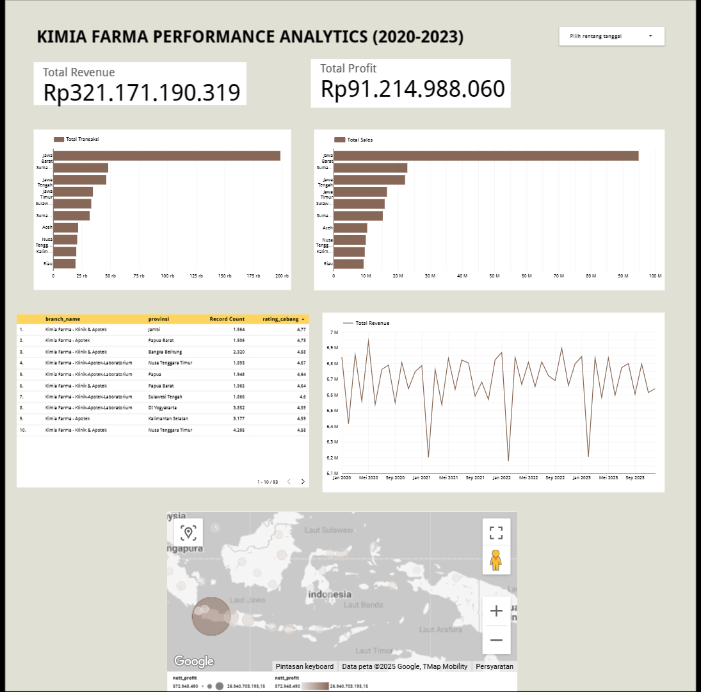

# Kimia Farma Performance Analytics (2020-2023)

## 📌 Project Overview
Project ini bertujuan untuk menganalisa kinerja bisnis Kimia Farma dari tahun 2020-2023. Analisa dilakukan dengan membandingkan dataset transaksi, produk, dan cabang untuk mendapatkan insight mengenai Top Cabang, Tren Pendapatan, dan Sebaran Profit.

## 🛠️ Tools Used
- **SQL (Google BigQuery):** Untuk data cleaning dan agregasi data.
- **Google Looker Studio:** Untuk visualisasi data dan dashboard interaktif.

## 🔍 Key Insights
1. **Total Revenue:** Rp 321 Milyar.
2. **Top Provinsi:** Jawa Barat mendominasi jumlah transaksi tertinggi.
3. **Problem Area:** Beberapa cabang memiliki rating tinggi (4.9+) namun jumlah transaksinya sangat rendah, mengindikasikan perlunya strategi marketing lokal.

## 📊 Dashboard Preview

[➡️ Klik di sini untuk melihat Dashboard Interaktif](https://lookerstudio.google.com/reporting/da38a349-6698-4245-a55e-9781d0db8b7a/page/D9gjF))

## 📄 SQL Query
File query lengkap dapat dilihat di `kimia_farma_analysis.sql`.
